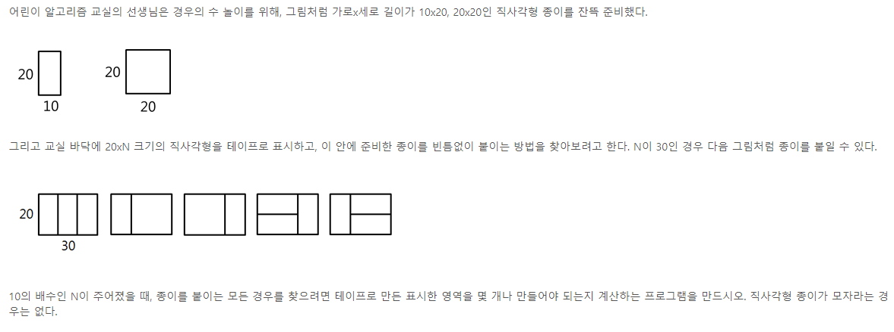
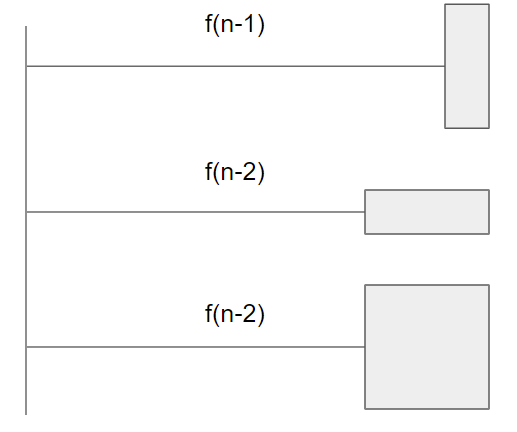

# 수열(점화식)

1. 맨 앞에서부터 규칙을 찾거나
2. 맨 마지막에서부터 규칙을 찾는다

## 종이붙이기 문제

### 마지막에서부터 규칙 찾기

1. 맨 마지막에 붙일 수 있는 경우의 수를 최대한 단순화해서 생각

   

2. 밑변의 길이 N이 주어졌을 때 만들 수 있는 경우는 위의 3가지 경우를 마지막에 붙였을 때이다

   

3. 위의 3가지 경우를 더하면 점화식이 완성된다

4. $$f(n) = 2f(n-2) + f(n-1)$$

