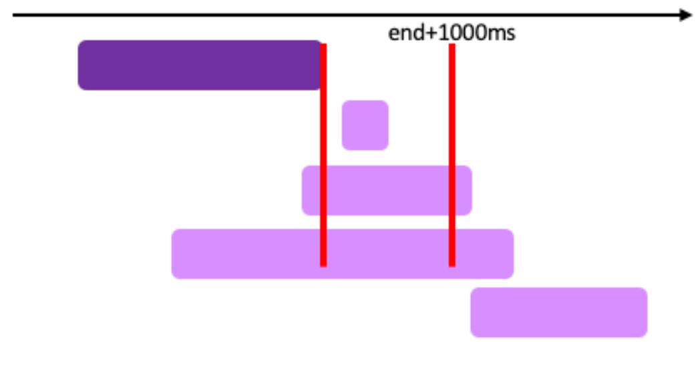

###### 문제 설명

## 추석 트래픽

이번 추석에도 시스템 장애가 없는 명절을 보내고 싶은 어피치는 서버를 증설해야 할지 고민이다. 장애 대비용 서버 증설 여부를 결정하기 위해 작년 추석 기간인 9월 15일 로그 데이터를 분석한 후 초당 최대 처리량을 계산해보기로 했다. **초당 최대 처리량**은 요청의 응답 완료 여부에 관계없이 임의 시간부터 1초(=1,000밀리초)간 처리하는 요청의 최대 개수를 의미한다.

### 입력 형식

- `solution` 함수에 전달되는 `lines` 배열은 **N**(1 ≦ **N** ≦ 2,000)개의 로그 문자열로 되어 있으며, 각 로그 문자열마다 요청에 대한 응답완료시간 **S**와 처리시간 **T**가 공백으로 구분되어 있다.
- 응답완료시간 **S**는 작년 추석인 2016년 9월 15일만 포함하여 고정 길이 `2016-09-15 hh:mm:ss.sss` 형식으로 되어 있다.
- 처리시간 **T**는 `0.1s`, `0.312s`, `2s` 와 같이 최대 소수점 셋째 자리까지 기록하며 뒤에는 초 단위를 의미하는 `s`로 끝난다.
- 예를 들어, 로그 문자열 `2016-09-15 03:10:33.020 0.011s`은 2016년 9월 15일 오전 3시 10분 **33.010초**부터 2016년 9월 15일 오전 3시 10분 **33.020초**까지 **0.011초** 동안 처리된 요청을 의미한다. **(처리시간은 시작시간과 끝시간을 포함)**
- 서버에는 타임아웃이 3초로 적용되어 있기 때문에 처리시간은 **0.001 ≦ T ≦ 3.000**이다.
- `lines` 배열은 응답완료시간 **S**를 기준으로 오름차순 정렬되어 있다.

### 출력 형식

- `solution` 함수에서는 로그 데이터 `lines` 배열에 대해 **초당 최대 처리량**을 리턴한다.

### 입출력 예제

#### 예제1

- 입력: [
  2016-09-15 01:00:04.001 2.0s,
  2016-09-15 01:00:07.000 2s
  ]
- 출력: 1

#### 예제2

- 입력: [
  2016-09-15 01:00:04.002 2.0s,
  2016-09-15 01:00:07.000 2s
  ]
- 출력: 2
- 설명: 처리시간은 시작시간과 끝시간을 **포함**하므로
  첫 번째 로그는 `01:00:02.003 ~ 01:00:04.002`에서 2초 동안 처리되었으며,
  두 번째 로그는 `01:00:05.001 ~ 01:00:07.000`에서 2초 동안 처리된다.
  따라서, 첫 번째 로그가 끝나는 시점과 두 번째 로그가 시작하는 시점의 구간인 `01:00:04.002 ~ 01:00:05.001` 1초 동안 최대 2개가 된다.

#### 예제3

- 입력: [
  2016-09-15 20:59:57.421 0.351s,
  2016-09-15 20:59:58.233 1.181s,
  2016-09-15 20:59:58.299 0.8s,
  2016-09-15 20:59:58.688 1.041s,
  2016-09-15 20:59:59.591 1.412s,
  2016-09-15 21:00:00.464 1.466s,
  2016-09-15 21:00:00.741 1.581s,
  2016-09-15 21:00:00.748 2.31s,
  2016-09-15 21:00:00.966 0.381s,
  2016-09-15 21:00:02.066 2.62s
  ]
- 출력: 7
- 설명: 아래 타임라인 그림에서 빨간색으로 표시된 1초 각 구간의 처리량을 구해보면 `(1)`은 4개, `(2)`는 7개, `(3)`는 2개임을 알 수 있다. 따라서 **초당 최대 처리량**은 7이 되며, 동일한 최대 처리량을 갖는 1초 구간은 여러 개 존재할 수 있으므로 이 문제에서는 구간이 아닌 개수만 출력한다.
  

[해설 보러가기](http://tech.kakao.com/2017/09/27/kakao-blind-recruitment-round-1/)

## 문제 해결

문제를 이해하는데 개인적으론 굉장히 오래 걸렸던 문제였다. 요청량이 변하는 시점이 각 로그의 시작과 끝 시점이라는 것은 이해했으나 이걸 어떻게 활용해야할지 감이 잘 안왔었는데, 중요한 사실 한가지를 빼먹고 있어서였다. 바로 들어오는 로그의 끝 시점들이 **오름차순으로 정렬**되어있다는 사실이다. 즉, 로그들을 하나씩 비교할 때 다음 로그는 현재 비교하는 종료 시점보다 늦게 끝남을 보장받는다. 이를 이용해보면,

> 현재 로그의 끝 시점보다 다른 로그의 시작 시점이 작거나 같다면,
>
> 다른 로그의 끝 시점은 현재 로그의 끝 시점보다는 무조건 크거나 같기 때문에
>
> 해당 로그들은 동시에 처리되고 있다는 사실을 알 수 있다.

여기서 우리가 필요한 것은 초당 최대 처리량이므로 끝 시점에서 1초만 더해주면 된다. 



따라서 현재 로그의 종료시점에서 1초를 더한 시점보다 비교하는 로그의 시작 시점이 빠르거나 같다면, 해당 구간 안에서 트래픽이 같이 처리되고 있다는 말이 된다. 로그의 종료시점을 기준으로 오름차순 정렬되어 있기 때문에, 비교할 때 자신보다 앞의 시점을 가진 로그들을 비교대상에서 빼고 계산해야 한다. 그래야 해당 구간을 제외한 구간들의 계산을 제대로 할 수 있다.

이 부분만 잘 이해하면 나머지는 시간을 파싱하거나 하나의 단위로 통합하는 문제이므로 크게 어렵지 않다.

```python
import datetime
def solution(lines):
    answer = 0
    times = []
    for line in lines:
        date, time, second = line.split(' ')
        end_time = datetime.datetime.strptime(date + " " + time, '%Y-%m-%d %H:%M:%S.%f')
        process_time = datetime.timedelta(seconds=float(second.split('s')[0]))
        start_time = end_time - process_time + datetime.timedelta(seconds=float(0.001))
        times.append([start_time, end_time])

    cnts = []
    for i in range(len(times)):
        cnt = 0
        for j in range(i, len(times)):
            start, end = times[i]
            cmp_s, cmp_e = times[j]

            e_cover_range = end + datetime.timedelta(seconds=float(0.999))
            
            if cmp_s <= e_cover_range:
                cnt += 1
                
        cnts.append(cnt)
    
    answer = max(cnts)
    
    return answer
```

