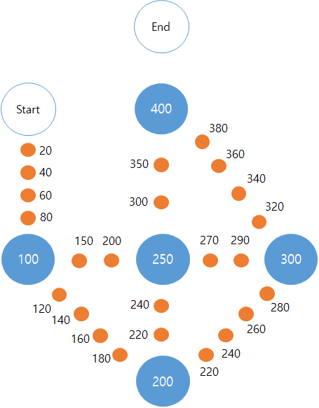

# 2019.10.20

# 1. 문제 조건

* 윷을 10번 던짐
* 윷은 1~5의 숫자로 주어짐(1: 도, 2: 개, 3: 걸, 4: 윷, 5: 모)
* 말판이 주어짐
* 4개의 말 주어짐
* 특정 위치에서는 무조건 이동 방향 바뀜(100, 200, 250)
* 시작과 끝을 제외한 어느 위치에서도 말이 겹칠 순 없음
* 윷을 10번 던졌을 때 4개의 말을 사용해서 얻을 수 있는 최대 점수

# 2. 문제 유형

* backtracking

# 3. 풀이 과정

