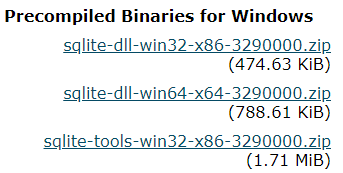

# Database

## 2019.09.23

## 데이터베이스를 배우는 이유

* 편하게 데이터를 관리하기 위해서

## SQL 개념

* SQL(Structured Query Language)는 관계형 데이터베이스 관리시스템(RDBMS)의 데이터를 관리하기 위해 설계된 특수 목적의 프로그래밍 언어
* 관계형 데이터베이스 관리 시스템에서 자료의 검색과 관리 데이터베이스 스키마 생성과 수정, 데이터베이스 객체 접근 조정 관리를 위해 고안되었다.


## SQL 사용하기

* 오픈소스 RDBMS 중 하나인 SQLite를 사용하여 진행한다

### SQLite 설치

* sqlite 홈페이지 접속하여 다음 파일 download



* 위에서 다운로드한 파일들을 모아주기 위한 폴더 sqlite 생성

  ```
  mkdir ~/sqlite
  ```

* sqlite 폴더 안에 sqlite-dll-win64-x64-3290000.zip 과 sqlite-tools-win32-x86-3290000.zip에서 압축 푼 파일들 넣기

* sqlite 폴더의 경로를 환경 변수 => 사용자 변수 => path 변수에 넣어주기

* .bashrc 파일에서 명령어 alias 사용하여 sqlite3로 축약

  ```
  alias sqlite3="winpty sqlite3"
  ```

* `sqlite3 --version` 으로 설치 확인
* `sqlite3 [db_name.sqlite3]`: DB 실행

#### SQLite 기본 명령어

* `.help`: 명령어 도움말
* `.exit` => 빠져나가는 명령어

* `.databases` => db의 경로가 어디인지 확인

* `.tables` => excel로 치면 sheet, 즉 tables 목록 확인

* 쿼리 명령어를 날릴 땐 항상 `;`으로 끝내줘야한다


## DB 실습 프로젝트 폴더 생성

```
$ sqlite3 tutorial.sqlite3 # db 실행
SQLite version 3.29.0 2019-07-10 17:32:03
Enter ".help" for usage hints.
sqlite> .mode csv # csv 파일 불러오기 위해 준비
sqlite> .import hellodb.csv examples # hellodb.csv 파일 읽어서 examples라는 이름의 table을 생성
sqlite> .tables # table 목록 확인
.schema [table_name] # table schema 확인
```

#### Table 처럼 결과물 나오게 하기

```
sqlite> .headers on; # header 표시
sqlite> .mode column; # column으로 나누는 걸 표현해줌
sqlite> select * from examples;
```

### Table 생성

```
CREATE TABLE [table_name](
	[var_name] [var_property],
	[var_name] [var_property],
	...
);
```

- 이전에 삭제된 행의 값을 재사용하지않고 사용하지 않은 다음 행값으로 사용하게 하려면 어떻게 해야할까?
- PRIMARY KEY AUTOINCREMENT => AUTOINCREMENT 속성 사용. 안하면 delete할 때 문제 생김

### Table 삭제

1. Table 자체 삭제

```
DROP TABLE [table_name];
```

2. Table의 행 삭제

```
DELETE FROM [table_name] WHERE [column_name]=value;
```

### Table 삽입

```
INSERT INTO [table_name] (column_name,column_name, ...) VALUES (column_value, column_value);
```

limit, offset은 한세트// 개념을 잘 알아두자(게시판 댓글 페이지와 유사)

### Table 수정

```
UPDATE [table_name] SET [column_name]=value WHERE [column_name]=value;
```

### Table 변경

```
ALTER TABLE [table_name] ADD COLUMN [column_name] [DATATYPE]; # column 추가
ALTER TABLE [old_table_name] RENAME TO [new_table_name]; # table 이름 변경
```


### 조회 명령문

```
SELECT [column_name] FROM [table_name];
```

* 특정한 table에서 원하는 개수만큼 Column 가져오기
  * Limit [number]

### 조건문

* WHERE 구문 사용

#### LIKE 구문

##### 와일드카드

* %: 자릿수 제한 없이 모든 것
* _ : 자릿수


## 기타

SQL 구문 과목평가에 있을 예정. 잘 공부해두자!