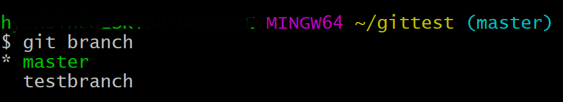
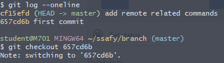
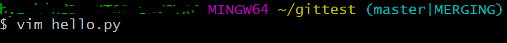

# Git command

## basic command

### git init

* create .git file
* create git repository in your working directory
* you are able to use git!!

### git add

* add the file in git repository
* git is able to track your file

#### how to use

* `git add .`: add files in the current location

* `git add [file_name]`: add the file named *file_name*

### git commit

* submit revision history to repository
* if you modify something in your git directory or files, you must do this

#### how to use

* `git commit`: you can create commit message in vim

* `git commit -m "commit_message"`: simplify  git commit process

* `git commit -a -m "commit_message"`: simplify git add and commit process

### unstaging

* `git rm --cached [file_name]`: unstage file
* `git rm --cached -r`: unstage all file

---

## branch

* 기존 프로젝트에 영향이 가지 않는 새로운 실험적 기능을 추가하거나, 기존 기능을 변경해야 하는 상황을 고려할 때 주로 사용
* 여러 사람이 협업해야하는 대규모 프로젝트에서 유용
* 기존의 메인 스트림인 master branch를 유지하고 병렬적으로 branch들을 활용함. 때문에 서로 독립적이어서 merge를 하지 않는 이상 영향을 주지 않음

### git branch

* check current branch list
* create new branch

#### how to use

* `git branch`: show current branch list

* `*` means the branch you're working on
* `git branch [branch_name]`: create new branch named *branch_name*
* `git branch -d [branch_name]`: delete branch

### git checkout

* you navigate between the branches created by `git branch`
* 커밋 로그의 특정 시점으로 돌아갈 수 있음(과거로 돌아가는 것과 비슷)

#### how to use

* `git checkout [branch_name]` & `git switch [branch_name]`: move from current branch to *branch_name* branch
* `git checkout -b [브랜치이름]` & `git switch -c [브랜치이름]`:  브랜치 생성하면서 바로 해당 브랜치로 이동
* `git checkout [커밋로그]`: 커밋 로그의 특정 시점으로 돌아감

* `git checkout master`: 현 시점으로 다시 돌아옴 // 마스터 브랜치로 다시 돌아옴

### git merge

* The `git merge` command lets you take the independent lines of development created by `git branch` and integrate them into a single branch
* The current branch will be updated to reflect the merge, but the target branch will be completely unaffected

#### how to use

* `git merge [target_branch]`: 현재 브랜치에서 특정 브랜치를 병합
* `git diff`: 충돌 났을 때 문서끼리의 차이점 보고싶을 때 사용

#### Git Merge Sceanario

1. fast-forward merge
2. auto merge (without conflict)
3. merge with conflict

#### precautions

if you face with conflict error, you can see this

#### Conflict 해결방법

##### conflict 발생조건

* 동일 라인의 내용이 다를 경우(거의 100% 일어남) // 동일 파일은 잘 안 일어남

## git log

* `git log` command lets you check commit history

#### how to use

* `git log -p`

* `git log --word-diff`

* **`git log --stat`**

* `git log --name-only`

* `git log --relative-date`

* **`git log --graph`**: show branches and merged histories in graph

* **`git log --oneline`**: commit history 한 줄로 요약
* `git log --oneline --graph`

---

## Git remote repository

### git clone

원격 저장소의 모든 내용을 로컬 저장소로 복사

#### how to use

* `git clone [remote_repository_url.git]`
  * `git status`로 상태 확인하면 나오는 origin은 원격 저장소의 별명. 클론하게 되면 기본적으로 클론한 저장소의 이름을 origin으로 짓는다

### git remote

로컬 저장소를 특정 원격 저장소와 연결

#### how to use

* `git remote add [저장소별칭] [remote_repository_url.git]`
* `git remote`: 원격저장소의 리스트(이름)
* 아무런 반응이 없으면 성공적으로 명령이 실행된 것
* `git remote -v`: 연결된 원격 저장소  확인

### git push

로컬 저장소의 내용을 보내거나 로컬 저장소의 변경 사항을 원격 저장소로 보냄

#### how to use

* `git push`
  * 처음 푸시할 때 어느 원격 저장소로 발행할 것인지, 로컬의 어느 브랜치를 푸시할 것인지 명시하지 않으면 에러 발생
* `git push [저장소별칭] [로컬브랜치이름]`
  * `git push origin --all`: origin 저장소에 로컬의 모든 브랜치를 푸시

### git fetch

로컬 저장소와 원격 저장소의 변경 사항이 다를 때 이를 비교 대조하고 git merge 명령어와 함께 최신 데이터를 반영하거나 충돌 문제 등을 해결

### git pull

* git remote 명령을 통해 서로 연결된 원격 저장소의 최신 내용을 로컬 저장소로 가져오면서 병합. git push와 반대의 역할
* `git fetch` + `git merge`가 합쳐진 명령어

## Remove Git Info in Local

* `git credential reject` : 이 명령어 이후에 아래 명령어들을 입력
  * `protocol=https`
  * `host=github.com`
  * ``host=lab.ssafy.com`
  * 마지막으로 enter 두번 눌러준다
* `git config --unset --global user.name`
* `git config --unset --global user.email`

## Set Git Info

- `git config --list` : 현재 설정된 이름과 메일 주소를 확인할 수 있다.
- `git config --global user.name ['원하는 이름']` : user.name을 변경할 수 있다.
- `git config --global user.email ['메일주소']` : user.email을 변경할 수 있다.