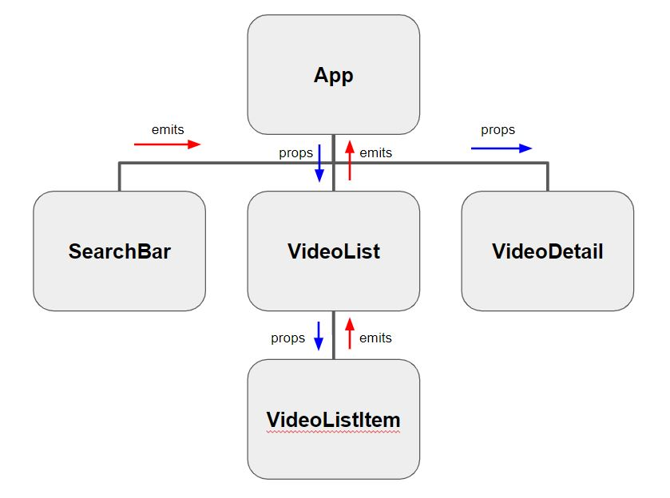
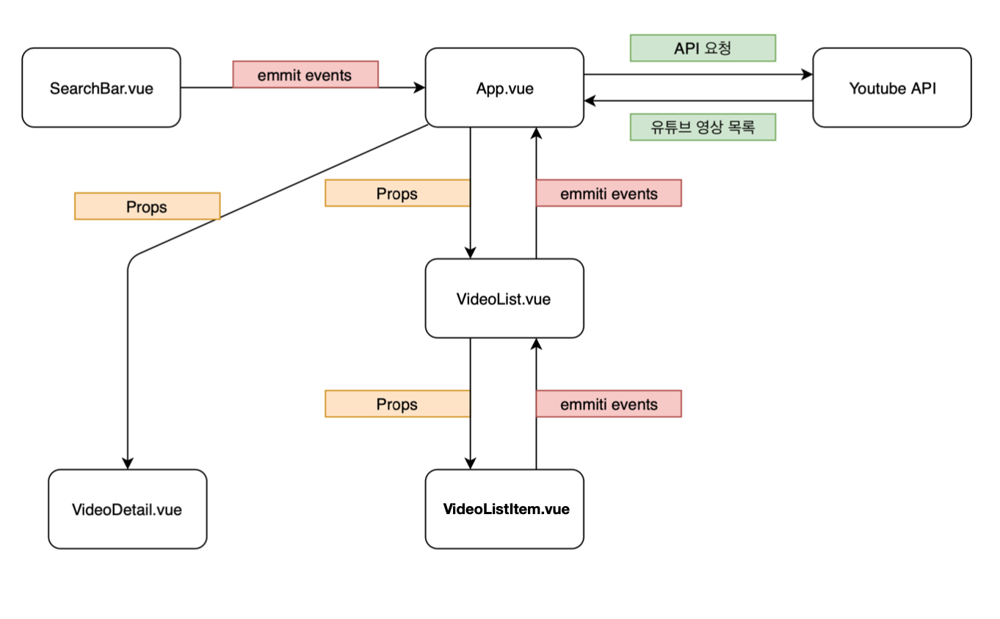

# Youtube Searcher

## 목적

* Vue.js 개발 프로세스를 통한 youtube search 페이지 구현
* 컴포넌트 기반의 구조에 대한 이해
* axios를 통한 비동기적 데이터 처리에 대한 이해

## Google API 사용하기

구글 api 입력 형식은 다음과 같다.

`https://www.googleapis.com/youtube/v3/search?key=API_KEY&type=video&part=snippet&q=검색어`

API를 사용할 때 필수적으로 `API KEY`를 발급받아야 하는데, 발급 받은 `API KEY`를 숨기기 위해서 `.env.local` 이라는 이름을 가진 file을 만들고 다음과 같은 방법을 사용한다.

* 접두어로 `VUE_APP_[var_name]=[value]`

```
VUE_APP_YOUTUBE_API_KEY=XXXXXXXXXXXXXXX
```

## Searcher App 만들기

### 컴포넌트 구조





### App.vue

### SearchBar.vue

### VideoList.vue

### VideoListItem.vue

### VideoDetail.vue


# style scoped

컴포넌트마다 스타일 먹이기

```vue
<style scoped>
  .bg-color-search-bar {
    background-color: bisque;
  }
</style>
```

부모의 스코프가 제일 우선순위가 높다