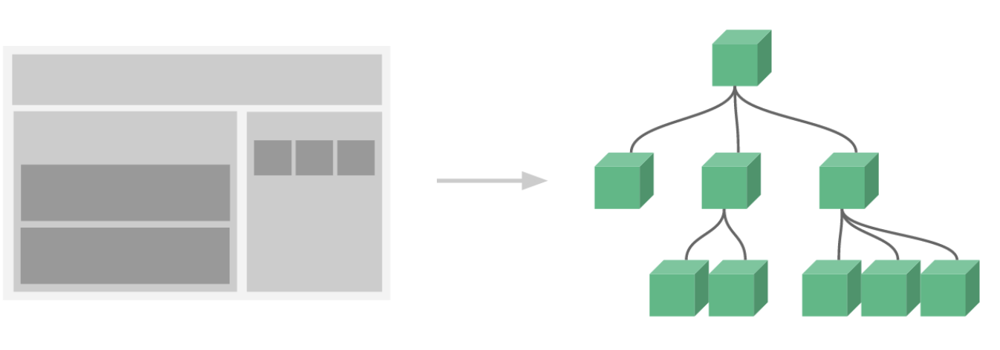

# Vue Component

## 개념

컴포넌트는 Vue 의 가장 강력한 기능 중 하나다. 기본 HTML 요소를 확장하여 **재사용 가능한 코드를 캡슐화**한다.

**모든 Vue 컴포넌트는 Vue 인스턴스다.** 그러므로, 모든 options 객체를 사용할 수 있다(root에서만 사용할 수 있는 옵션은 제외).

한 Vue app 안에서 각 컴포넌트들은 Root 인스턴스를 시작으로 부모-자식 컴포넌트의 관계를 가진다.

Vue cli 환경에서 사용하는 방법과 일반적인 HTML, JS에서 사용하는 방법이 다르다.

## 컴포넌트 간의 통신

컴포넌트는 부모-자식 관계에서 가장 일반적으로 함께 사용하는 것이다.

컴포넌트 A는 자체 템플릿에서 컴포넌트 B를 사용할 수 있다. 컴포넌트끼리는 필연적으로 서로 의사 소통이 필요하다. 부모는 자식에게 데이터를 전달해야 할 수도 있으며, 자식은 자신에게 일어난 일을 부모에게 알릴 필요가 있다.

그러나 부모와 자식이 명확하게 정의된 인터페이스를 통해 가능한 분리된 상태로 유지하는 것도 매우 중요하다. 이렇게하면 각 컴포넌트의 코드를 상대적으로 격리할 수 있도록 작성하고 추론할 수 있으므로 유지 관리가 쉽고 재사용하기도 쉬워진다.

Vue.js에서 부모-자식 컴포넌트 관계는 props는 아래로, events는 위로 라고 요약할 수 있다.  부모는 **props**를 통해 자식에게 데이터를 전달하고 자식은 **emit events**를 통해 부모에게 메시지를 보낸다.

