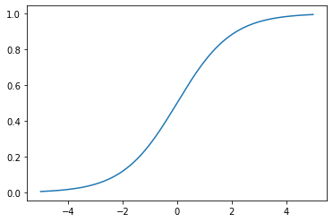
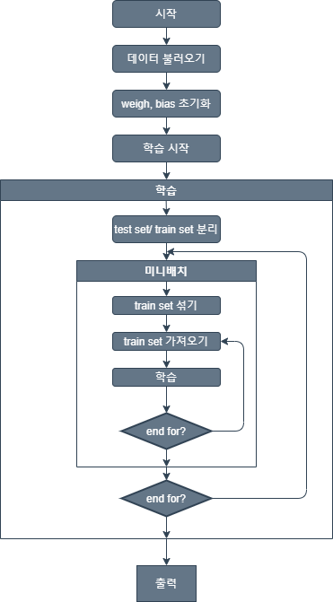

# 이진 판단: 천체의 펄서 여부 판정 신경망

Created: Apr 22, 2020 4:32 PM
Materials: https://www.notion.so/1-3-d2e44e1bb53f419cba9ebaf6468fec7a
Part: SLP
Reviewed: No
type: Binary Decision

## 2.1 펄서 판정 문제

천체 1만 7898개에 8가지 특징값과 펄서 여부가 표시

특징에는 'integrated profile', 'DM-SNR curve'값에 대한 평균과 표준편차, 첨도 뒤틀림 등을 포함

데이터셋에서 1639개만 펄서

## 2.2 이진 판단 문제의 신경망 처리

> 이진 판단 문제는 예/아니오 혹은 0/1 같은 두 가지 값 중 하나로 답하는 문제다.

이를 인공지능 신경망으로 처리하는데는 몇가지 장애물이 존재

- 퍼셉트론은 선형 연산

    → 두 가지 값으로 결과를 제한 불가

    → 선형 연산 결과가 임계치를 넘는지에 따라 결정하는 방법?

    → 미분이 불가능해 학습이 어려움

    → 확률에 해당하는 값을 추정해 1에 가까우면 참, 0에 가까우면 거짓으로 하는 방법

    → 출력 범위 제한은 어떻게?

    **→ 비 선형 함수를 이용. 시그모이드 함수**

- 신경망 출력을 확률로 해석했지만 어떻게 학습?

    → 값이 0 이상이면서 추정이 정확해질수록 작아지는 성질이 있는 손실 함수 정의

    **→ 두 확률 분포가 얼마나 다른지 표현해주는 교차 엔트로피 (손실 함수 정의도 만족)**

    → 시그모이드 함수의 교차 엔트로피값을 손실 함수로 정의해 신경망 학습

나머지 신경망 혹은 주변 처리는 회귀 분석 문제와 비슷

## 2.3 시그모이드 함수

> 시그모이드 함수 (sigmoid function)는 범위에 제한 없는 임의의 실숫값을 입력으로 받아 확률값의 범위에 해당하는 0과 1 사이의 값을 출력하는 함수다.
σ(x)로 표시

시그모이드 함수는 입력 x가 어떤 확률값의 로짓(logit)표현이라고 간주

- 로짓(logit)?

    실제 표현하려는 값을 로그값으로 대신 나타낸 것

    로짓값은 상대적이며 의미를 가지려면 비교 로짓값이 필요

    - 로짓값의 이점
        - 넓은 범위의 값을 간단히 표현
        - 값의 변화를 변화량보다 변화 비율 관점에서 더 민감하게 포착 가능

다시 돌아와, 시그모이드 함수는 입력값을 '답이 참일 가능성을 로짓으로 표시한 값'이라 간주

이때 이 로짓값이 의미를 가지기 위해선 '비교 대상'이 필요

**→ 거짓일 경우에 대한 로짓값을 0으로 간주**

→ 입력값이 나타내는 확률의 정확한 값을 구할 근거 마련

시그모이드 함수는 다음으로 정의

$$σ(x) = \frac{1}{1+e^{-x}}$$



sigmoid 함수는

- 입력범위 제한 없음
- 출력은 0과 1사이 값
- 입력이 0일때 출력은 0.5이며 애매한 경우를 의미
- 입력이 양수 → 출력 0.5 이상이며 참을 선택하라는 의미

0.51 확률의 참 vs 0.99 확률의 참

- 0.51 확률의 참
    - 선택이 옳든 틀리든 파라미터 수정 필요
- 0.99 확률의 참
    - 정답일 때, 파라미터 수정 거의 불필요
    - 거짓일 떄, 대폭 수정 필요(파라미터값이 크게 변화)

바람직한 문제 해결 능력을 갖춘다?

- 0 혹은 1에 수렴하는 값을 낼 때

시그모이드 함수의 미분

$$σ'(x)=σ(x)(1-σ(x)) = y(1-y),\\ 여기서~~y = σ(x)$$

## 2.4 확률 분포와 정보 엔트로피

> 확률 분포의 무질서도나 불확실성 혹은 정보 표현의 부담 정도를 나타내는 정보 엔트로피

m가지의 결과가 p1,...,pm확률로 일어나는 무작위 사건을 표현할 때

- 2가지 결과일 땐 1비트 (0, 1)로 구별
- 4가지 결과일 땐 2비트 (00, 01, 10, 11)로 구별
- 그럼 3가지 결과라면? → 4비트를 이용

    →만약 이경우가 k번 나온다면?

즉,

$$2^n \ge 3^k \\ \frac{n}{k} \ge \log_2 3$$

으로 사건 하나를 표현하는데 필요한 비트수는 1.585

따라서, m가지 결과가 나올 때 한 사건을 표현하는데 필요한 최소 비트수는

$$\log_2 m$$

이 값이 바로 **정보량**

이를 확률 분포로 확장해서, 일반적으로 어떤 사건이

$$p_1 = \frac{1}{a_1}, \dots , p_m = \frac{1}{a_m}$$

이라면 이 사건의 정보량은 각 경우가 갖는 정보량을 각 경우의 확률에 따라 가중 평균하여

$$\frac{1}{a_1} \log_2 a_1 + \cdots + \frac{1}{a_m} \log_2 a_m = \sum_{i=1}^m \frac{1}{a_i} \log_2 a_i$$

**정보를 압축하는 허프만 코드(huffman code)**

> 허프만 코드는 표현하려는 대상의 분포 비율을 조사해 자주 나타나는 대상에는 짧은 이진 코드를, 간혹 나타나는 대상에는 긴 이진 코드를 할당해 전체 표현에 필요한 비트 수를 줄여주는 정보 압축 기법


주어진 확률 분포에 대한 정보 엔트로피

$$H = \sum_{i=1}^m \frac{1}{a_i} \log_2 a_i = -\sum_{i=1}^m p_i \log_2  p_i, ~~\text{여기서}~p_i = \frac{1}{a_i}$$

- 1 이하의 확률값이 로그함수에 주어지면 0혹은 음수가 나오기 때문에 엔트로피는 항상 0 이상

정보 엔트로피

- 어떤 확률 분포로 일어나는 사건을 표현하는 데 필요한 정보량
- 값이 커질수록 확률 분포의 불확실성이 커지며 결과에 대한 예측이 어려움

## 2.5 확률 분포의 추정과 교차 엔트로피

교차 엔트로피

- 두 가지 확률 분포가 얼마나 비슷한지를 숫자 하나로 나타내는 개념

정보 엔트로피 = 정보량의 기댓값

P에대한 Q의 교차 엔트로피

- 분포 Q에 따른 정보량을 갖는 사건이 P에 따라 일어날 때 정보량의 가중 평균

    $$H(P,Q) = -\sum p_i \log q_i$$

- 두 확률 분포가 같은 내용일때 해당 분포의 정보 엔트로피와 동일

    $$H(P,Q) \ge H(P,P)$$

- 두 확률 분포가 닮아갈수록 값이 줄어듬 → H(P,Q)는 H(P,P)로 수렴

## 2.6 딥러닝 학습에서의 교차 엔트로피

학습 중이어서 수시로 수정되는 딥러닝 모델에 추정 확률 분포 P가 있고 타겟으로 하는 미지의 확률분포 Q가 있다고 가정할 때

- 교차 엔트로피 값이 작아지는 쪽으로 P를 꾸준히 수정 → 학습

→ 논리적으로 2가지 어려움

- 애당초 확률 분포 Q를 정확히 알지 못하는 상태
- 확률 분포 Q는 입력에 따라 변하는 조건부 확률 분포

해결 방안

- 모범 답안으로 주어지는 레이블 정보를 입력에 따른 조건부 확률 분포로 P를 재해석하고 이를 이용해 교차 엔트로피를 계산
- 즉, 레이블 정보의 내용을 추정 확률 분포 P가 접근해야할 목표인 입력에 대한 출력의 조건부 확률 분포로 간주해서 교차 엔트로피 계산

딥러닝의 궁극적 목표

- 새로운 입력에도 유사한 문제 풀이 경험을 통해 답을 내어놓는 것

이진 판단 딥러닝

- 입력에 대해 직접 출력을 추정하지 않고 결과가 참 혹은 거짓일 가능성을 입력에 따른 조건부 확률 분포로 추정
- 입력 데이터와 입력에 대한 출력값의 조건부 확률 분포사이의 상관관계 패턴이 학습 과정 중에 신경망에 반영
- 이진 판단 문제의 핵심은 답 자체보다 답이 나오게 되는 확률 분포

## 2.7 시그모이드 교차 엔트로피와 편미분

이진 판단 문제에 대한 학습 데이터의 정답으로 z가 주어지고 신경망 회로는 로짓값 x가 출력됬을 때 정답이 나타내는 확률분포와 신경망이 추정하는 확률 분포 사이의 교차 엔트로피

$$H=x-xz + \log(1+ e^{-x})$$

시그모이드 교차 엔트로피 정의식 도출 과정

- 참일 확률이 z, 거짓일 확률이 1-z
- 신경망 회로의 출력이 로짓값x로 계산됬을 때 참에 대응하는 확률값은 σ(x), 거짓에 대응하는 확률 값은 1-σ(x)
- 이를 교차 엔트로피 정의식에 대입

    $$H(P,Q)=-\sum p_i \log q_i \\= -p_T \log q_T-p_F \log q_F \\ = -z \log \sigma(x) - (1-z)\log(1-\sigma(x))$$

- 시그모이드 함수의 정의를 대입해 정리하면


일반적으로 이진 판단 문제의 정답은 0과 1로 주어지므로

$$z=0~일~때~H=x-\log \sigma(x) \\ z=1~일~때~H=-\log \sigma(x), \\ 여기서~~\log \sigma(x) = \log (1+e^{-x})$$


시그모이드 함수에 대한 교차 엔트로피의 편미분

$$\frac{\partial H}{\partial x} =-z + \sigma(x)$$

## 2.8 계산값 폭주 문제와 시그모이드 관련 함수의 안전한 계산법

x = -1000 일 때 기존 시그모이드 관련 함수의 exp(1000)는 표현하기에 지나치게 큰 값

→ 오버플로 오류 발생 ( 계산 과정중 inf가 발생했다는 경고)

해결책

- **x가 음수일 때 계산을 달리 하는 것**
- 하지만, 조건문을 쓰면 효율이 감소

따라서 아래 식 사용

$$\sigma(x) = \frac{e^{-\max(-x,0)}}{1+e^{-|x|}} \\ H = \max(x,0) - xz + \log(1+e^{-|x|})$$

## 2.9 구현하기 : 펄서 여부 판정 신경망

**구현순서**

- 메인 함수 정의
- 데이터 적재 함수 정의
- 이진 판단 후처리를 위한 순전파 및 역전파 함수 재정의
- 정확도 계산함수 재정의
- 시그모이드 관련 함수 정의

**호출 관계**


[Variables](https://www.notion.so/56d59f6c482d49829e3a810265cb4a5a)

Flowchart



### 2.9.4 후처리 과정에 대한 순전파와 역전파 함수의 재정의

```python
def forward_postproc(output, y):
    entropy = sigmoid_cross_entropy_with_logits(y, output)
    loss = np.mean(entropy)
    return loss, [y, output, entropy]

def backprop_postproc(G_loss, aux):
    y, output, entropy = aux

    g_loss_entropy = 1.0 / np.prod(entropy.shape) #------------------------------------③
    g_entropy_output = sigmoid_cross_entropy_with_logits_derv(y, output) #-------------④

    G_entropy = g_loss_entropy * G_loss #----------------------------------------------⑤
    G_output = g_entropy_output * G_entropy #------------------------------------------⑥
```

③ g_loss_entropy

$$\frac{\partial L}{\partial~entropy} = \frac{\partial}{\partial~entropy} \biggl( \frac{1}{N} \sum entropy \biggr) = \frac{1}{N}$$

④ g_entropy_output

$$\frac{\partial~entropy}{\partial~y} = \frac{\partial~\text{sigmoid\_cross\_entropy\_with\_logit}}{\partial~y}$$

⑤ G_entropy

$$\frac{\partial~L}{\partial~entropy} = \frac{\partial~L}{\partial~L}\frac{\partial~L}{\partial~entropy}$$

⑥ G_output

$$\frac{\partial~L}{\partial~y} = \frac{\partial~L}{\partial~entropy}\frac{\partial~entropy}{\partial~y}$$

## 2.11 확장하기 : 균형 잡힌 데이터셋과 착시 없는 평가 방법

펄서 예측 데이터 셋의 데이터들은 90.8% 정도가 일반 별이고 9.2%정도가 펄서

→ 무조건 펄서가 아니라고만 답해도 90%이상의 정확도 달성 가능

→ **착시 현상**

해결 방안

→ 데이터셋에서 별과 펄서가 비슷한 수가 되도록 데이터 비율 바꾸기

- 펄서 데이터를 중복 사용해 일반 별 데이터와 같은 수로 만들기
- 중복되는 데이터에는 잡음 추가

→ **착시 현상이 해결되면서 정확도가 하락할 수 있음**

정확도 대신 신경망의 성능을 잘 보여줄 평가지표 필요

- 정밀도(precision)
- 재현율(recall)
- F1 값

정밀도

- 신경망이 참으로 추정한 것 가운데 정답이 참인 것의 비율

재현율

- 정답이 참인 것들 가운데 신경망이 참으로 추정한 것의 비율

정밀도와 재현율 중 하나만 살피는 것은 의미가 없음

- 참이라고 많이 답할 수록 재현율이 증가
- 거짓을 많이 답하면 정밀도 상승

→ 두 값을 함께 높이는 것이 목표

F1 값

- 정밀도와 재현율의 조화평균
- 정밀도와 재현율의 두 값을 경계로 하는 구간 안의 값
- 두 값중 작은 쪽에 가까워 짐
- 계산 과정이 복잡하고 직관적 느낌이 낯설어 정확도보다 덜 쓰임

TP, TN, FP, FN - Confusion matrix

- TP  : True Positive, 실제 True인데, 예측이 True라고 판단된 경우
- TN : True Negative , 실제 False인데,  예측이 False라고 판단된 경우
- FP : False Positive, 실제 False인데, 예측이 True라고 판단된 경우
- FN : False Negative, 실제 True인데, 예측이 False라고 판단된 경우


[https://subscription.packtpub.com/book/big_data_and_business_intelligence/9781838555078/6/ch06lvl1sec34/confusion-matrix](https://subscription.packtpub.com/book/big_data_and_business_intelligence/9781838555078/6/ch06lvl1sec34/confusion-matrix)

이에 따라 네가지 평가지표는 다음과 같이 정의


이 방법으로 예제 프로그램 확장

**구현 및 실행 순서**

- 메인 실행 함수와 데이터 적재함수 재정의
- 정확도 계산 함수와 출력 관련 함수 재정의
- 원래 비율의 데이터를 이용한 학습과 네가지 평가지표 값의 확인
- 균형 잡힌 데이터를 이용한 학습과 네 가지 평가지표 값의 확인

[Variables](https://www.notion.so/3a8a85014d71448a84ef8af578e0e8c5)

## 2.12 실행하기
