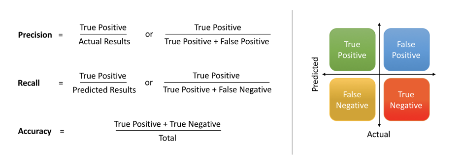

# Model Performance

어떤 모델이든 간에 발전을 위한 feedback은 현재 모델의 performance를 올바르게 평가하는 것에서 시작된다. 이번 글에서는 모델이 평가해야하는 요소와 그것을 수치화한 지표들, 관련 개념들에 대해서 다룬다.

## Precision VS Recall

[이미지 출처](https://towardsdatascience.com/precision-vs-recall-386cf9f89488)

### Precision(정밀도)

**정밀도**란 모델이 True 라고 예측(정답이라고 예측)한 것 중에서 실제 True인 것의 비율이다. 예를 들어 암 진단 모델이 암에 걸렸다고 예측했는데, 실제 암에 걸린 환자의 비율이라고 할 수 있다.

### Recall(재현율)

**재현율**이란 실제 True인 데이터 중에서 모델이 True라고 예측한 것의 비율이다. 예를 들어, 실제 암에 걸린 환자들 중 암 진단 모델이 암에 걸렸다고 예측한 환자의 비율이라고 할 수 있다. 정밀도와 True Positive 관점을 다르게 바라보는 것이라고 할 수 있다.

### Trade-off

 즉 정밀도와 재현율은 모두 실제 정답인 값을 모델이 정답이라고 예측한 경우에 관심이 있으나, 바라보고자 하는 관점이 다른 것이라고 할 수 있다. 정밀도는 **모델의 입장**에서, 재현율은 **실제 정답(data)**의 입장에서 정답을 정답이라고 맞춘 경우를 바라보고 있다.

예를 들어, 확실하게 암에 걸린 환자만 예측하기 위해 암의 판단 여부가 애매한 환자는 아예 예측을 하지 않고 보류하여(FP의 경우의 수를 줄여) 정밀도를 극단적으로 올렸다고 가정해보자. 환자 총 30명 중에서 실제 암에 걸린 환자가 20명인데, 확실하게 암에 걸린 2명만 암(FP가 0)이라고 예측한다면, 정밀도는 100%가 나오게 된다. 하지만 이런 모델은 이상적인 모델이 될 수 없다.

따라서, 우리는 실제 환자 20명 중에서 암에 걸렸다고 예측한 수도 고려해야 한다. 이 경우(재현율) 10%로 정밀도만큼 높게 나오지 않는다.  즉 정밀도와 재현율은 상호보완적이며, 두 지표가 모두 높게 나와야 좋은 모델이라고 할 수 있다. 하지만 정밀도와 재현율은 trade-off 관계(FP와 FN이 반대로 움직임)이기도 하여 함께 늘리기가 힘든 경우가 많다.

## F1 Score

정밀도와 재현율을 모두 참고해야 좋은 모델이라고 한다면, 어떻게 두 지표를 조합해서 하나의 지표로 사용할 수 있을까? 를 고민하게 된다.

### Precision과 Recall의 (산술)평균값을 지표로 사용

| Model      | Precision(P) | Recall(R) |
| ---------- | ------------ | --------- |
| 알고리즘 1 | 0.5          | 0.4       |
| 알고리즘 2 | 0.7          | 0.1       |
| 알고리즘 3 | 0.02         | 1.0       |

$$
\frac {P+R} 2
$$

산술 평균값을 사용하게 된다면, 알고리즘 1은 0.45, 알고리즘 2는 0.4 알고리즘 3은 0.51이 나와서 최종 알고리즘을 3으로 결정하게 된다. 하지만 사실 알고리즘 3은 오차가 100% 가까운 모델로 최악의 모델이라고 할 수 있다.

### Precision과 Recall의 (조화)평균값을 지표로 사용

$$
2 \frac {PR} {P+R}
$$

이 경우에는, 알고리즘 1은 0.44, 알고리즘 2는 0.175, 알고리즘 3은 0.039가 나와서 알고리즘 1을 최종 모델로 결정하게 된다. 이와 같이 Precision과 Recall의 적절한 조합에 가중치를 주는 모델을 F1 Score라고 부르고 통계학과 머신러닝에서 넓게 활용된다. F1 Score는 큰 비중이 끼치는 bias가 줄어들게 하는 조화 평균을 사용하기 때문에 데이터 label이 불균형 구조일 때도 모델의 성능을 정확하게 평가할 수 있다.

