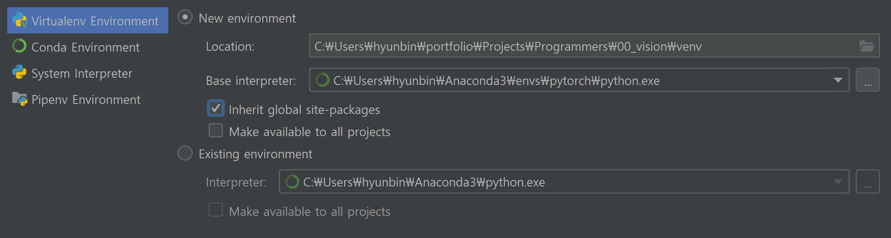

# Pytorch 설치하기

> GPU 환경에서 작동하는 Pytorch 설치하는 방법

##### Cuda 버전 확인

* cmd창 or git bash에서 명령어 입력
  * `nvcc --version`
  * 현 시점에서는 9.0 cuda version이 설치되어 있음
  * 나중에 필요해지면 cuda 설치도 다룰 예정

## Pytorch 설치

1. conda 가상환경 준비
2. pytorch 설치
3. 설치가 잘 되었는지 test

global conda 환경이 아닌 특정 가상환경에서만 해당 패키지를 사용하기 위해 conda 가상환경을 만든다.

`conda create -n [venv_name] python=3.7` 명령어로 가상 환경을 만든 후, cmd 창에서 `conda activate [venv_name]` 명령어로 가상환경을 활성화시킨다.

해당 가상환경에서 `conda install pytorch torchvision cudatoolkit=9.0 -c pytorch` 명령어로 pytorch를 설치한다.

Pycharm 의 `Project Interpreter`  탭에서 그림과 같이 설정해준다. **Inherit global site-packages** 옵션을 체크해야 conda 가상환경에서 설치한 패키지를 사용할 수 있다.



설치 후에, 다음 명령어로 test를 해본다.

```python
import torch
print(torch.cuda.get_device_name(0))
print(torch.cuda.is_available())
print(torch.__version__)
```

```
>>> GeForce GTX 1050 Ti with Max-Q Design
>>> True
>>> 1.1.0
```

## Jupyter notebook

주피터 노트북에서 Pytorch를 사용하기 위해서는 다음과 같은 작업을 별도로 수행해줘야한다.

1. `conda install ipykernel` 명령어로 주피터 노트북 패키지를 설치한다.

2. `python -m ipykernel install --user --name pytorch --display-name "PyTorch"` 명령어로 주피터에 새 kernel을 등록한다.

주피터 노트북을 실행해 `PyTorch`란 이름의 커널이 있는지 확인한다.