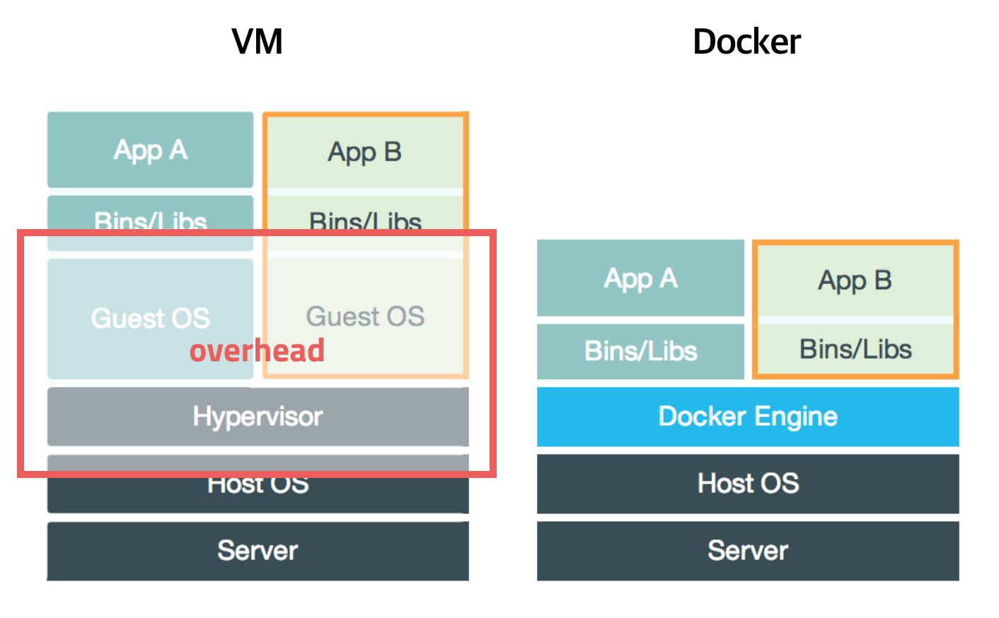

# Docker Instruction

이 글은 모두의 딥러닝 시즌2 강의를 정리했음을 밝힙니다.

## 개요

다른 사람의 컴퓨터(환경설정)에서는 잘 돌아가는 코드가 내 컴퓨터에서 안돌아가는 상황, 즉 애플리케이션을 작동시키기 위해 필요한 라이브러리나 애플리케이션등을 하나로 모아, 마치 별도의 서버인 것처럼 사용할 수 있게 만들기 하기 위해 **도커**를 사용한다.

도커를 사용하게 되면 가상화 머신처럼 독립된 운영체제를 여러개 띄울 필요가 없다. 같은 운영체제 위에 도커를 띄우게 되면 어느 컴퓨터에서도 돌아가는 가상환경을 여러개 띄울 수 있다. 

[이미지출처](https://www.google.co.uk/url?sa=i&source=images&cd=&ved=2ahUKEwjX9rijob7mAhXHFIgKHXO8Dk0QjRx6BAgBEAQ&url=https%3A%2F%2Fsubicura.com%2F2017%2F01%2F19%2Fdocker-guide-for-beginners-1.html&psig=AOvVaw2HFuRqQg4g0yF_dyA0ODmx&ust=1576726276227080)

 

## Download for Windows

도커는 원래 리눅스 서버를 생각하고 만든 것이기 때문에 별도의 가상머신이나 하이퍼바이저를 사용하기 때문에 리눅스 만큼의 성능이 나오지 않고 GPU를 사용할 수 없다.

### 설치방법

사용 운영체제가 Windows 10 Pro(64-bit) 환경이므로 [Docker for Windows](https://runnable.com/docker/install-docker-on-windows-10)를 설치한다.

사이트에 나와있는 방법대로 설치 후에 

- 제어판 => 프로그램 및 기능 => Windows 기능 켜기/끄기 => Hyper-v 체크

bash창이나 cmd창에서 `docker run hello-world` 명령어로 잘 설치되었는지 확인한다.

기본 사용방법은 [Docker User Guide](https://github.com/deeplearningzerotoall/PyTorch/blob/master/docker_user_guide.md)를 참고한다.

