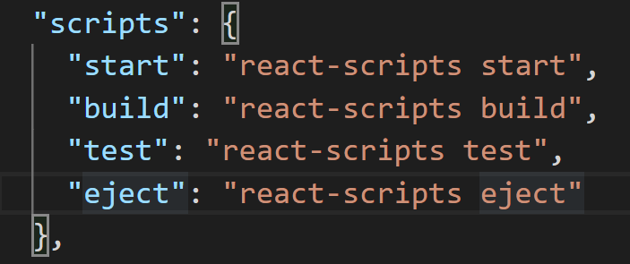
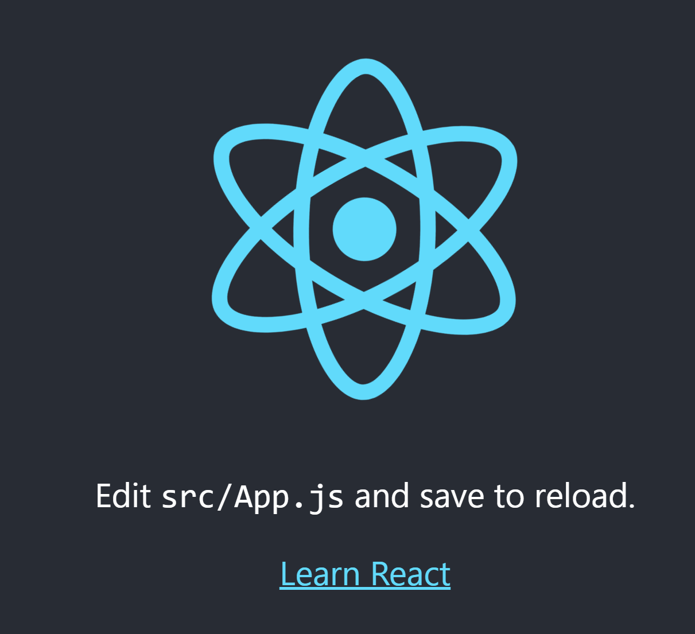

# React 시작하기

## 프로젝트 만들기

`npx create-react-app [app_name]` 명령어로 프로젝트 폴더를 생성합니다. 

프로젝트 폴더를 만들고 나서 `package.json` 파일의 `scripts` 변수를 수정해주는 작업을 진행합니다.



`test`와 `eject`는 필요하지 않기 때문에 지워줍니다.

## 서버 실행하기

`npm start`  명령어로 서버를 실행시킵니다. 다음의 화면이 뜨면 성공한 것입니다.



## 기본 동작

`public/index.html` 파일의 `<div>`태그에서 `src`  폴더에서 만든 App을 렌더링합니다.

`src/index.js` 파일을 보면 렌더링시 태그의 id 속성이 `root`인 태그를 가져와서 렌더링하는 것을 알 수 있습니다.

```react
import React from 'react';
import ReactDOM from 'react-dom';
import App from './App';

ReactDOM.render(<App />, document.getElementById('root'));
```

이런 방식으로 리액트는 소스코드에 처음부터 HTML을 넣지 않고, 컴포넌트에서 작성한 HTML을 추가하거나 제거할 수 있게 된다.