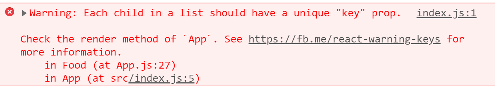
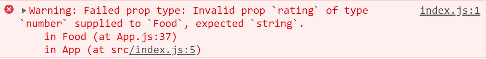

# React Basic

이번 장에서는 리액트를 구성하는 컴포넌트의 기본적인 개념과 사용법에 대해서 다루도록 하겠습니다.

## Component

component는 HTML을 반환하는 함수입니다. 결국 react는 component를 사용해서 HTML처럼 작성하려는 것임을 알 수 있습니다. javascript와 HTML 사이의 이러한 조합을 jsx라고 부르고 jsx 개념은 react에만 특화된 매우 유니크한 개념입니다. 따라서 다른 framework에서는 jsx 개념을 활용하지 못할 수 있습니다.

컴포넌트의 기본적인 형태는 다음과 같습니다.

```react
<App />
```

컴포넌트를 작성하기 위해선 필수적으로 문서의 최상단에

```react
import React from 'react'
```

구문을 써줘서 react가 jsx가 있는 component를 사용하는 것을 이해할 수 있도록 해줘야 합니다. 주의해야 할 점은 react application은 하나의 component만을 rendering 할 수 있기 때문에 `index.js` 파일에 존재해야하는 컴포넌트는 App 컴포넌트 하나입니다. 다른 컴포넌트에서는 여러개의 컴포넌트를 임포트해도 상관이 없습니다.

다음으로 간단한 Potato 컴포넌트를 작성해보도록 하겠습니다. 먼저 `Potato.js`로 컴포넌트를 만들고 나서 다음 내용을 작성해줍니다.

```react
import React from 'react'

function Potato() {
    return <h3>I love Potato</h3>
}

export default Potato
```

Potato 컴포넌트를 만든 후에는 `App.js` 파일에서 Potato 컴포넌트를 import 해줍니다.

```js
import React from 'react';
import Potato from './Potato'

function App() {
  return (
    <div className="App">
      <h1>Hello</h1>
      <Potato />
    </div>
  );
}

export default App;
```

이런 식으로 컴포넌트를 사용하면 가독성이 좋고 동적인 app을 만들 수 있습니다.

## Component 사용

### Props 속성 사용

컴포넌트에서 자식 컴포넌트에 데이터를 전달해주는 Props 속성을 사용하는 방법에 대해서 알아보도록 하겠습니다.

```react
import React from 'react';

function Food(props) {
  console.log(props)
  return <h3>I like potato!!</h3>
}

function App() {
  return (
    <div className="App">
      <h1>Hello</h1>
      <Food 
      name="kimchi"
      something={true}
      papa={["hello",1,2,3,4,5]}/>
    </div>
  );
}

export default App;
```

Food 자식 컴포넌트에 App 부모 컴포넌트가 데이터를 전달해주기 위해선 자식 컴포넌트 태그 안에 원하는 속성이름과 값을 지정해주기만 하면 됩니다. props로 전달된 속성들은 `props.name`, `props.someting`, `props.papa` 처럼 지정해준 이름으로 접근할 수 있고 속성에 바로 접근하고 싶으면 다음의 방법을 사용합니다.

```react
function Food({name}) {
return <h3>I like {name}!!</h3>
}
```

### 반복문에서의 Props 사용

```react
function renderFood(dish) {
  return <Food name={dish.name}/>
}

function App() {
  return (
    <div className="App">
      {foodILike.map(renderFood)}
    </div>
  );
}
```

react에서 반복문(map, forEach)을 통해 props 속성을 사용할 때 props에 key 속성을 정해주지 않으면 콘솔창에 다음과 같은 경고가 발생하게 됩니다.



이 에러를 해결하기 위해 자식 컴포넌트에게 데이터를 전달할 때 props에 key 속성을 함께 전달해줘야 합니다. 이 속성은 보통 react 내부에서 사용하기 때문에 직접 접근해서 사용하는 경우는 없습니다.

```react
function renderFood(dish) {
  console.log(dish.id)
  return <Food key={dish.id} name={dish.name}/>
}
```

### Props 속성 유효성 검사

자식 컴포넌트 입장에서는 부모 컴포넌트에서 전달받은 props들이 예상한 타입의 props가 맞는지 확인해야할 필요가 있습니다. 잘못된 props를 넘겨받으면 기능이 정상적으로 작동하지 않고 앱의 규모가 커질수록 어디서 잘못되었는지 바로 확인하기가 힘들기 때문입니다.

유효성 검사를 하기 위해선 먼저 관련 패키지를 설치해야 합니다. 터미널에서 `npm i prop-types` 명령어를 통해 설치합니다. 잘 설치되었는지는 `package.json` 파일의 `dependencies` 변수에서 확인할 수 있습니다.

prop-types를 사용하기 위해서 import를 합니다.

```react
import PropTypes from 'prop-types';
```

import를 하고 나서 유효성 검사를 위해 다음과 같은 작업을 해줍시다. prop-types를 사용하기 위해선 반드시 이름을 `componentName.propTypes`로 설정해줘야 합니다.

```react
function Food({name, rating}) {
  return (
    <div>
      <h3>I like {name}!!</h3>
      <h4>{rating/5.0}</h4>
    </div>
    )
}

Food.propTypes = {
  name: PropTypes.string.isRequired,
  rating: PropTypes.string.isRequired
};
```

web 화면상에서는 에러 없이 rating 값을 5.0으로 나눈 값이 보입니다. 하지만 위에서 rating에 들어올 값을 **string 타입**으로 설정해줬기 때문에 콘솔 창에서 에러가 발생하는 것을 확인할 수 있습니다.



isRequired는 반드시 체크해줄 필요는 없습니다. isRequired가 없으면 해당 변수에 값이 없어도 에러가 뜨지 않습니다.