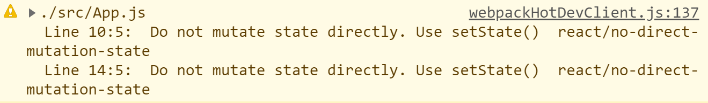
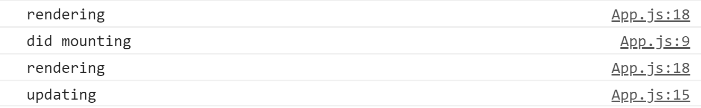

# Class Component and State

지금까지 작성한 것은 function을 기반으로 한 컴포넌트였습니다. 이번 장에서는 클래스를 사용한 component와 state 개념에 대해서 다뤄보도록 하겠습니다.

## Class Component

class라는 이름에서 알 수 있다시피 react에서 만들어지는 모든 component는 component에 필요한 기본 기능을 가지고 있는  `React.Component`를 상속받아 사용해 불필요한 작업을 하지 않도록 한다.

```react
import React from 'react';
// React.Component 클래스는 렌더링해주는 함수 render를 가지고 있다.
class App extends React.Component {
  render() {
    return <h1>I'm a Component</h1>
  }
}

export default App;
```

### State

state는 동적인 데이터를 사용하기 위한 개념이다. object로 만들고 클래스 안에서 선언되었기 때문에 `this`로 접근해서 사용한다.

```react
class App extends React.Component {
  state = {
    count: 0
  }
  render() {
  return <h1>I'm a {this.state.count}</h1>
  }
}
```

동적인 데이터를 사용한다는 것을 보여주기 위해 state 안에서 선언된 변수의 값을 변경해보도록 하겠다. add와 minus라는 함수를 클래스 내부에서 만들어 state안의 count 변수 값을 변경한다. 이 때 버튼을 눌렀을 때 값이 변경되도록 하기 위해 `onClick`이라는 속성을 사용한다. 함수를 호출할 때는 `this.add()`와 같은 방법이 아니라 `this.add`와 같이 함수의 이름만을 적도록 한다. 앞의 방법을 사용하게 되면 버튼을 클릭할 때마다 호출되는 게 아니라 처음에 한 번 호출되고나서 더이상 호출되지 않는 문제가 발생한다.

```react
class App extends React.Component {
  state = {
    count: 0
  }
  add = () => {
    console.log("add")
    this.state.count = 1
  }
  minus = () => {
    console.log("minus")
    this.state.count = -1
  }
  render() {
    return (
      <div>
        <h1>I'm a {this.state.count}</h1>
        <button onClick={this.add()}>Plus</button>
        <button onClick={this.minus}>Minus</button>
      </div>
    )
  }
}
```

하지만 이와 같이 state의 count변수에 직접 접근해 값을 변경하게 되면 state에 직접 접근해서 값을 변경하지 말라는 에러를 보게 된다.



state의 값을 변경하고 싶으면 react에서 제공해주는 `setState` 함수를 사용하면 된다. 이 함수를 사용하면 값을 변경하고 `render` 함수를 호출해줘 화면이 바뀌게 된다. 페이지가 리로딩되는 개념이 아님에 유의하자. 값을 변경할 때는 콜백함수를 호출하는 방법과 그냥 하는 방법이 있는데 전자의 방법이 선호되고 fancy한 방법이기 때문에 전자의 방식을 사용하도록 한다.

```react
class App extends React.Component {
  state = {
    count: 0
  }
  add = () => {
    this.setState(current => ({count:current.count + 1})) // fancy한 방법
  }
  minus = () => {
    this.setState({count:this.state.count - 1}) // 선호되지 않음. 성능 문제
  }
  render() {
    return (
      <div>
        <h1>I'm a {this.state.count}</h1>
        <button onClick={this.add}>Plus</button>
        <button onClick={this.minus}>Minus</button>
      </div>
    )
  }
}
```

### Component Life Cycle

리액트가 컴포넌트를 생성하고 없애는 방법이다.

리액트는 기본적으로 컴포넌트가 생성될 때, render 전에 호출되는 몇 가지 function들과 render 후에 호출되는 function들이 있다.

1. mounting: 태어나는 것
2. updating: 업데이트
3. unmounting: 컴포넌트가 죽는 것을 의미한다.
   - 페이지를 바꿀 때
   - state를 사용해 컴포넌트를 교체할 때 등이 있다.

#### Mounting

- `constructor()`: js에서 클래스를 만들 때 호출된다.
- `render()`
- `componentDidMount()`: 컴포넌트가 처음 render가 됐다는 것을 알려준다.

#### Updating

state를 변경할 때, 업데이트가 일어난다.

- `render()`
- `componentDidUpdate()`: 컴포넌트가 업데이트 된 후에 렌더링이 끝나면 호출된다.

component life cycle을 이해하기 위해 간단하게 콘솔창을 통해서 알아보도록 한다.  처음 마운팅 과정에서 렌더링 후 `componentDidMount()`가 호출되고 `setTimeout()` 함수를 통해 5초 후에 state가 업데이트 되면서 다시 `render()`와 `componentDidUpdate()`가 호출 되는 것을 볼 수 있다.

```react
import React from 'react';
// import PropTypes from 'prop-types';

class App extends React.Component {
  state = {
    isLoading: true
  }
  componentDidMount() {
    console.log("did mounting")
    setTimeout(() => {
      this.setState({isLoading:false})
    }, 5000)
  }
  componentDidUpdate() {
    console.log("updating")
  }
  render() {
    console.log("rendering")
    const {isLoading} = this.state
    return <div>{isLoading ? "Loading..." : "We are ready"}</div>
  }
}

export default App;
```



