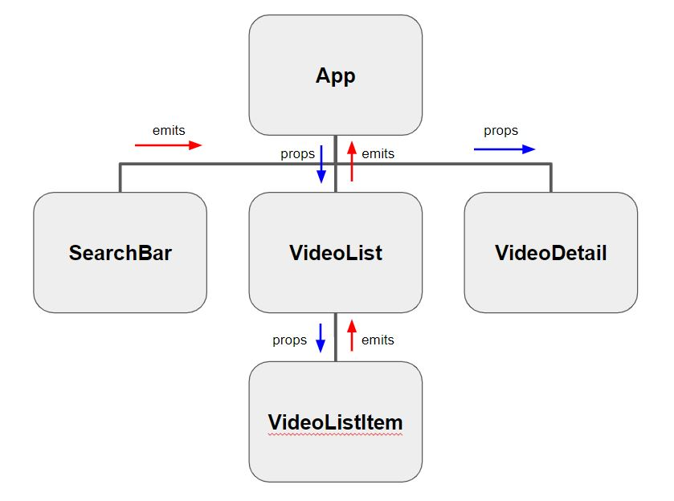

# Youtube Searcher

## 목적

* Vue.js 개발 프로세스를 통한 youtube search 페이지 구현
* 컴포넌트 기반의 구조에 대한 이해
* axios를 통한 비동기적 데이터 처리에 대한 이해

## Google API 사용하기

구글 api 입력 형식은 다음과 같다.

`https://www.googleapis.com/youtube/v3/search?key=API_KEY&type=video&part=snippet&q=검색어`

API를 사용할 때 필수적으로 `API KEY`를 발급받아야 하는데, 발급 받은 `API KEY`를 숨기기 위해서 `.env.local` 이라는 이름을 가진 file을 만들고 다음과 같은 방법을 사용한다.

* 접두어로 `VUE_APP_[var_name]=[value]`

```
VUE_APP_YOUTUBE_API_KEY=XXXXXXXXXXXXXXX
```

## Searcher App 만들기

### 컴포넌트 구조




### App.vue

#### Template

app.vue의 템플릿은 다음과 같이 구성된다.

```vue
<template>
  <div id="app">
    <h1>Youtube Searcher</h1>
    <!-- v-on 디렉티브를 통해 inputChange란 이름의 이벤트 탐색 후 onInputChange 메소드 호출 -->
    <SearchBar @inputChange="onInputChange"/> 
    <!-- 동적 바인딩을 통해 selectedVideo 데이터를 자식 컴포넌트에게 전달 -->
    <VideoDetail :video="selectedVideo"/>
    <!-- v-on 디렉티브를 통해 selectedVideo란 이름의 이벤트 탐색 후 renderVideo 메소드 호출 -->
    <VideoList :videos="videos" @selectedVideo="renderVideo"/>
  </div>
</template>
```

#### Script

스크립트는 다음과 같이 구성된다.

```vue
<script>
import axios from 'axios'

import SearchBar from './components/SearchBar'
import VideoList from './components/videos/VideoList'
import VideoDetail from './components/videos/VideoDetail'

const API_KEY = process.env.VUE_APP_YOUTUBE_API_KEY
const API_URL = 'https://www.googleapis.com/youtube/v3/search'

export default {
  name: 'app',
  // 컴포넌트 등록
  components: {
    SearchBar,
    VideoList,
    VideoDetail,
  },
  // 데이터 설정
  data() {
    return {
      videos: [],
      selectedVideo: null,
    }
  },
  // 메소드 설정
  methods: {
    onInputChange (inputValue) {
      axios.get(API_URL, {
        params: {
          key: API_KEY,
          type: 'video',
          part: 'snippet',
          q: inputValue,
        }
      }).then(res => {
        this.videos = res.data.items
      }).catch(err => {
        console.log(err)
      })
    },
    renderVideo(video) {
      this.selectedVideo=video
    }
  }
}
</script>
```

### SearchBar.vue

#### Template

SearchBar의 템플릿은 원하는 질의를 입력할 수 있도록 input 태그를 사용한다. input 태그를 통해 입력한 값은 emit으로 이벤트를 발생시켜 부모한테 값을 전달할 수 있도록 한다.

```vue
<template>
  <div>
    <input @change="onInput" type="text">
  </div>
</template>
```

#### Script

[vue 이벤트 핸들링](https://kr.vuejs.org/v2/guide/events.html)을 참고하여 적절한 값을 부모 컴포넌트에게 전달할 수 있도록 이벤트를 발생시킨다.

```vue
<script>
export default {
  name: 'SearchBar',
  methods: {
    onInput(event) {
      this.$emit('inputChange', event.target.value)
    }
  }
}
</script>
```

### VideoList.vue

#### Template

VideoList의 템플릿은 자식 컴포넌트인 VideoListItem 컴포넌트가 여러번 호출될 수 있도록 `v-for` 디렉티브를 사용한다.`v-for`는 `v-bind:key`와 함께 사용한다.

```vue
<template>
  <div>
    <h2>VideoList</h2>
    <ul>
      <VideoListItem v-for="video in videos" :key="video.id.videoId" :video="video" @videoSelect="onVideoSelect"/>
    </ul>
  </div>
</template>
```

#### Script

부모 컴포넌트인 app.vue에서 전달받은 데이터를 사용할 수 있도록 `props` 속성을 활용한다.

```vue
<script>
import VideoListItem from './VideoListItem'
export default {
  name: 'VideoList',
  components: {
    VideoListItem,
  },
  props: {
    videos: {
      type: Array,
    }
  },
  methods: {
    onVideoSelect(video) {
      this.$emit('selectedVideo', video)
    }
  }
}
</script>
```

### VideoListItem.vue

#### Template

리스트를 클릭하면 VideoDetail을 볼 수 있도록 적절한 이벤트를 걸어준다.

```vue
<template>
  <li @click="onSelect">
    
  </li>
</template>
```

#### Script

부모 컴포넌트인 VideoList로부터 데이터를 전달받아서 부모 컴포넌트로 데이터를 보낼 수 있도록 적절한 이벤트를 발생시킨다.

```vue
<script>
export default {
  name: "VideoListItem",
  props: {
    video: {
      type: Object,
      required: true
    }
  },
  methods: {
    onSelect() {
      this.$emit('videoSelect', this.video)
    }
  },
  computed: {
    thumbnailUrl() {
      return this.video.snippet.thumbnails.default.url
    }
  }
}
</script>
```

### VideoDetail.vue

해당 비디오에 대한 세부정보를 렌더링해준다.

#### Template

```vue
<template>
  <div>
    <h2>Video Detail</h2>
    <p>{{ video.snippet.title }}</p>
    <iframe :src="iframeUrl" frameborder="0"></iframe>
    <h3>상세내용</h3>
    <p>{{ video.snippet.description }}</p>
  </div>
</template>
```

#### Script

```vue
<script>
export default {
  name: 'VideoDetail',
  props: {
    video: {
      type: Object,
    }
  },
  computed: {
    iframeUrl() {
      const videoId = this.video.id.videoId
      return `https://www.youtube.com/embed/${videoId}`
    }
  }
}
</script>
```

# style scoped

컴포넌트마다 스타일 먹이기

```vue
<style scoped>
  .bg-color-search-bar {
    background-color: bisque;
  }
</style>
```

부모의 스코프가 제일 우선순위가 높다